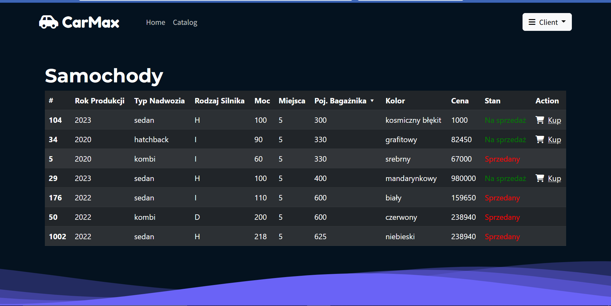

# Spring Car Dealership Web App
> Authors: Karol Babik, Maciej Kwiatkowski 

Application for car dealership based on Java Spring Framework cooperating with relational database Oracle Database 19c.
It is a second part of the project for Databases and Big Data lecture. In addition to [Java Spring Framework](https://spring.io), the following were also used here: 
- [Thymeleaf](https://www.thymeleaf.org) to integrate Spring with HTML templates 
- [Bootstrap](https://getbootstrap.com) to create the UI 
- [Twilio API](https://www.twilio.com/docs/usage/api) for sending sms messages

As mentioned previously this application cooperates with relational database Oracle Database 19c. The creation of this database was the frist part of the project three phases: conceptual - determining the ER model at the conceptual level, logical - determining the ER schema at the logical level and physical - physical implementation based on the ER logical schema.

## Screenshots

